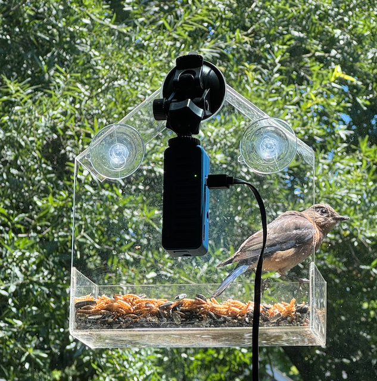
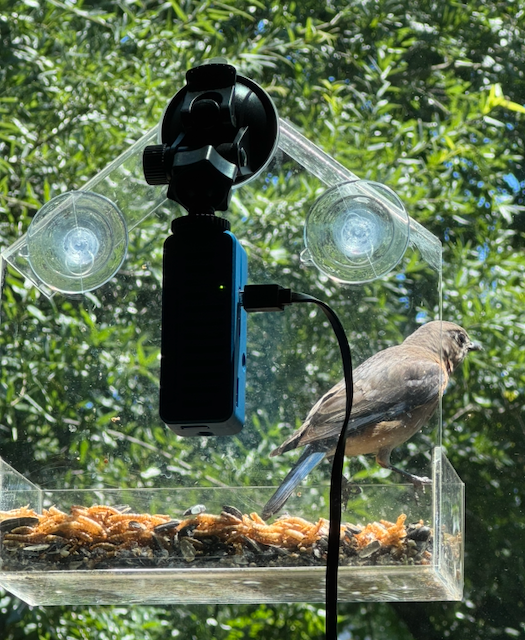
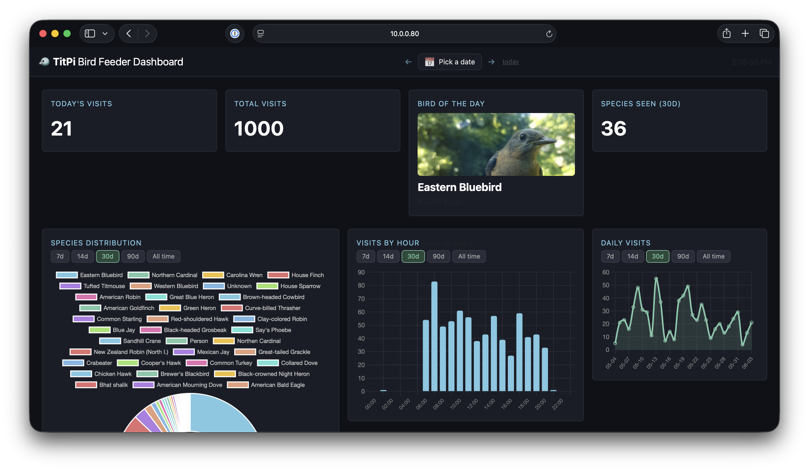
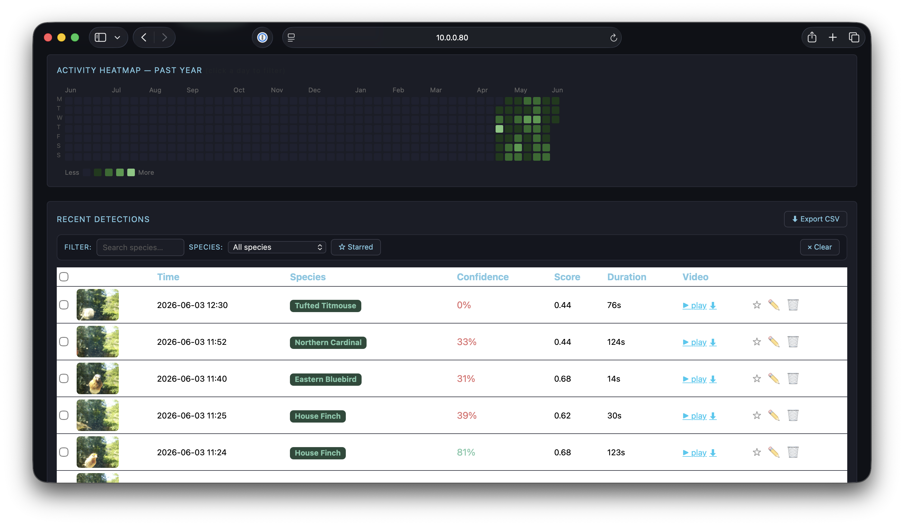

# :bird: TitPi: AI Bird Feeder Camera

This is a fun project I've been working for a while. Keeping track on the beautiful birds in the neighborhood!
A Raspberry Pi Zero 2W + Sony IMX500 AI Camera that watches your bird feeder 24/7, identifies every visitor by species, and serves a live dashboard — no cloud, no subscription.

Named after the **Tufted Titmouse** (**Tit**mouse + Raspberry **Pi** = TitPi). The project started because smart feeders like Birdfy charge a subscription for species detection and have painful apps. So I built something better.

📖 **Full story & deep-dive:** [renan.com/blog/titpi-ai-bird-feeder](https://renan.com/blog/titpi-ai-bird-feeder)

---





---

## How It Works

```
IMX500 (on-chip COCO detection)
  │
  ▼
watcher.py ── spike detection + baseline calibration
  │             captures photo + video on confirmation
  ▼
bird_id.py ── local TFLite classifier (AIY Birds V1, 964 species)
  │             ↓ confident (≥30%)? → done
  │             ↓ uncertain? → GPT-4o-mini fallback
  │             applies species aliases
  ▼
database.py ── SQLite (detections + bird_of_day tables)
  │
  ├─▶ notifier.py      email alerts (photo + video link/attachment)
  ├─▶ compute_botd.py   daily "Bird of the Day" (7 PM) + photo copy
  └─▶ web.py            Flask dashboard on port 8080
```

The IMX500 runs neural network inference directly on the sensor chip — the Pi barely wakes up until something interesting happens. Detection score spikes above a rolling baseline trigger a capture. A two-stage pipeline then identifies the species: fast local TFLite model first, GPT-4o-mini fallback for uncertain or tricky shots.

## Features

- **On-chip object detection** — IMX500 runs SSD MobileNet v2 at ~10 FPS with near-zero CPU load
- **Spike-based triggering** — adaptive baseline calibration prevents false positives from lighting changes
- **Dual species identification** — local TFLite classifier (Google AIY Birds V1, 964 species) runs first; GPT-4o-mini fallback for uncertain IDs
- **Species aliases** — normalizes variant names to canonical species via `species_aliases.json`
- **False positive cleanup** — automatically deletes photos/videos when neither classifier identifies anything
- **High-res capture** — 2028×1520 stills + H264 video (10–120s) on each confirmed detection
- **Web dashboard** — real-time stats, species doughnut chart (click to filter), hourly bar chart, 365-day activity heatmap, photo lightbox
- **Bulk management** — multi-select detections for bulk edit or delete from the dashboard
- **Bird of the Day** — daily ranking that prioritizes first-ever sightings, with photos saved to `detections/bird_of_the_day/`
- **Email alerts** — per-detection notifications with photo attachment; video attached or linked (configurable)
- **Auto-recovery** — systemd services with crash restart + frozen-pipeline detection (`os._exit` on camera hang)
- **Dual camera support** — works with IMX500 (AI Camera, on-chip detection) or Camera Module 3 (motion detection mode)

## Dashboard





## Hardware

| Component | Model | Approx. Cost |
|-----------|-------|-------------|
| Board | Raspberry Pi Zero 2W (or Pi 3/4) | ~$15 |
| Camera | Sony IMX500 (AI Camera) **or** Raspberry Pi Camera Module 3 | ~$70 |
| MicroSD | 32 GB+ | ~$8 |
| Case | 3D printed ([files in `3d model/`](3d%20model/)) | ~$2 in filament |
| **Total** | | **~$95** |

The case is designed to mount the Pi and the IMX500 together on a windowsill, pointing through the glass at the feeder. Keeping the electronics inside means no weather exposure and a direct power cable to an outlet.

Case design by **[Hanz](https://makerworld.com/en/@Hanz_3D_zz)** — [Raspberry Pi Zero Case + Camera V3/V2 for Tripod](https://makerworld.com/en/models/1357960-raspberry-pi-zero-case-camera-v3-v2-for-tripod?from=search#profileId-1401984) on MakerWorld. STL files are included in the [`3d model/`](3d%20model/) directory.

**OS:** Raspberry Pi OS Bookworm 64-bit


```
watcher.py            Main detection loop (always-on)
bird_id.py            Dual identification (local TFLite + GPT fallback)
bird_classify.py      TFLite classifier wrapper (AIY Birds V1)
database.py           SQLite schema and queries
web.py                Flask dashboard backend
compute_botd.py       Bird of the Day selection + photo copy (daily)
notifier.py           Email notifications (configurable video attach/link)
config.json           Runtime configuration (not tracked)
config_example.json   Configuration template
species_aliases.json  Maps variant species names to canonical names
tools/
  preview.py          Live MJPEG preview stream for setup
  backfill.py         Re-identify past detections in batch
  reidentify.py       Re-run identification on unknown detections
templates/
  dashboard.html      Single-page dashboard (Bootstrap + Chart.js)
detections/
  bird_of_the_day/    Daily best photo archive (YYYY-MM-DD.jpg)
services/
  titpi.service       Systemd unit — watcher
  titpi-web.service   Systemd unit — web dashboard
  titpi-botd.service  Systemd unit — bird of the day (one-shot)
  titpi-botd.timer    Systemd timer — triggers botd at 19:00
```

## Installation

### 1. Install dependencies

```bash
sudo apt update && sudo apt install -y imx500-all python3-picamera2 ffmpeg python3-flask python3-requests python3-pil python3-numpy
pip install --break-system-packages --user ai-edge-litert
```

### 2. Clone and configure

```bash
git clone https://github.com/your-user/titpi.git /home/titpi/titpi
cd /home/titpi/titpi
cp config_example.json config.json
# Edit config.json with your GitHub token, email credentials, and paths
```

### 3. Set up systemd services

```bash
sudo cp services/titpi.service services/titpi-web.service services/titpi-botd.service services/titpi-botd.timer /etc/systemd/system/
sudo systemctl daemon-reload
sudo systemctl enable --now titpi.service titpi-web.service titpi-botd.timer
```

The dashboard will be available at `http://<pi-ip>:8080`.

## Configuration

Copy `config_example.json` to `config.json` and fill in your values:

| Section | Key | Description |
|---------|-----|-------------|
| `camera` | `mode` | `"imx500"` (AI Camera) or `"motion"` (Camera Module 3) |
| `camera` | `confidence_threshold` | Minimum IMX500 detection score (default: 0.25) |
| `camera` | `spike_threshold` | Margin above baseline to trigger (default: 0.20) |
| `camera` | `baseline_frames` | Frames used to calibrate the idle baseline (default: 60) |
| `camera` | `confirmation_frames` | Consecutive spike frames required (default: 2) |
| `camera` | `cooldown` | Seconds between detections (default: 10) |
| `camera` | `target_labels` | COCO classes to detect (default: bird, person, dog) |
| `github` | `token` | GitHub PAT with Models permission |
| `github` | `model` | Vision model name (default: gpt-4o-mini) |
| `email` | `password` | SMTP app password for notifications |
| `email` | `attach_video` | Attach video file to email; `false` sends a link instead (default: true) |
| `local_classifier` | `enabled` | Enable local TFLite bird classifier (default: true) |
| `local_classifier` | `min_confidence` | Minimum score to trust local ID (default: 0.3) |

## Development

### Sync files to the Pi

```bash
rsync -az --progress ./ titpi@titpi.local:/home/titpi/titpi
```

### Restart after changes

```bash
ssh titpi@titpi.local "sudo systemctl restart titpi.service"
```

### Live camera preview (for aiming/setup)

```bash
ssh titpi@titpi.local "python3 /home/titpi/titpi/tools/preview.py"
# Open http://<pi-ip>:8081 in browser
```

### Backfill missing identifications

```bash
ssh titpi@titpi.local "python3 /home/titpi/titpi/tools/backfill.py"
```

## Local Classifier — AIY Birds V1

The local species classifier uses Google's **AIY Birds V1** MobileNet model, originally from the [AIY Vision Kit](https://aiyprojects.withgoogle.com/) project.

- **Model:** `aiy_birds_v1.tflite` — MobileNet V1, 224×224 input, uint8, 964 species
- **Labels:** `aiy_birds_labelmap.csv` — species scientific names
- **Common names:** `bird_common_names.json` — maps scientific → common names

These files are placed in the project root on the Pi (`/home/titpi/titpi/`) and are excluded from git (`.tflite` in `.gitignore`).

**Credit:** Model by Google, from the [AIY Vision Kit](https://aiyprojects.withgoogle.com/) / [TF Model Garden](https://github.com/google/aiy-maker-kit).

## License

MIT